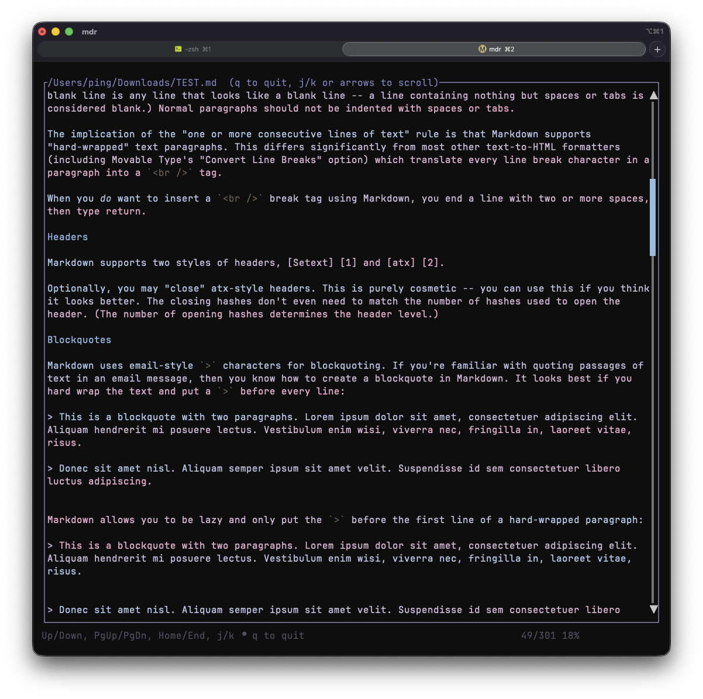

# mdr

A small TUI markdown reader for the terminal.

## Features
- Terminal UI with a pastel color theme.
- BeeLine-style gradient for easier line tracking (disable with `--no-beeline`).
- Keyboard navigation: Up/Down, j/k, Space/Tab for page down, Shift+Tab for page up.
- Mouse wheel scrolling.
- Basic markdown styling for headings, lists, emphasis, inline code, blockquotes, and rules.
- Tables with column fitting and multi-line cell wrapping.
- Scrollbar that hides when all content fits on screen.

## Screenshot
What it looks like.



## Usage
```bash
cargo run -- path/to/file.md
```

Disable BeeLine styling:
```bash
cargo run -- --no-beeline path/to/file.md
```

## Notes
- The UI is intentionally lightweight; rendering is plain-text with styling rather than full layout.
- Tables wrap long cells vertically to fit the current viewport width.
