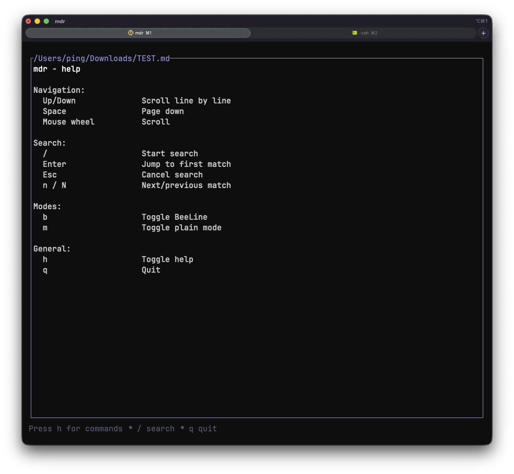

# mdr - Markdown Beeline Reader

A small, fast TUI markdown reader for the terminal. Clean pastel theme with BeeLine gradients for line tracking, mouse scroll + hover URL previews, keyboard-first navigation, and solid markdown coverage including tables and code blocks.


## Features
- Terminal UI with a pastel color theme.
- BeeLine-style gradient for easier line tracking (disable with `--no-beeline`, toggle with `b`).
- Plain mode toggle (`m`) for minimal styling.
- Multi-document queue with visual current-file indicator (`[current/total] path` in the title).
- Startup markdown discovery from mixed file and directory inputs.
- In-app markdown filesystem browser (`o`) starting from current working directory.
- Picker traversal support: enter directories, go to parent, and open markdown files directly.
- Keyboard navigation: Up/Down, Space or Tab for page down, `h` for commands.
- Mouse wheel scrolling and hover to show link URLs.
- Basic markdown styling for headings, lists, emphasis, inline code, blockquotes, and rules.
- Tables with column fitting and multi-line cell wrapping (headers preserved).
- Scrollbar that hides when all content fits on screen.
- Search with `/`, next/prev via `n`/`N`, and match highlighting (current match emphasized).
- Links are underlined and colored; press Enter to open the nearest link.



## Usage
```bash
cargo run -- path/to/file.md
```

Queue startup from mixed file + directory inputs:
```bash
cargo run -- path/to/file.md docs/
```

Disable BeeLine styling:
```bash
cargo run -- --no-beeline path/to/file.md
```

Install a local release build:
```bash
cargo install --path . --locked
```

## Key Bindings
- `Up/Down`: Scroll line by line
- `Space` or `Tab`: Page down
- `Backtab`: Page up
- `]`: Next document in queue
- `[`: Previous document in queue
- `g`: Go-to-document dialog for queue navigation
- `o`: Open markdown filesystem browser (from current working directory)
- `/`: Search
- `n` / `N`: Next / previous match
- `b`: Toggle BeeLine
- `m`: Toggle plain mode
- `h`: Help
- `q`: Quit
- `Enter`: Open nearest link

## Install
```bash
cargo install --path . --locked
```

## Build
```bash
cargo build --release
```

## Notes
- The UI is intentionally lightweight; rendering is plain-text with styling rather than full layout.
- Tables wrap long cells vertically to fit the current viewport width.
